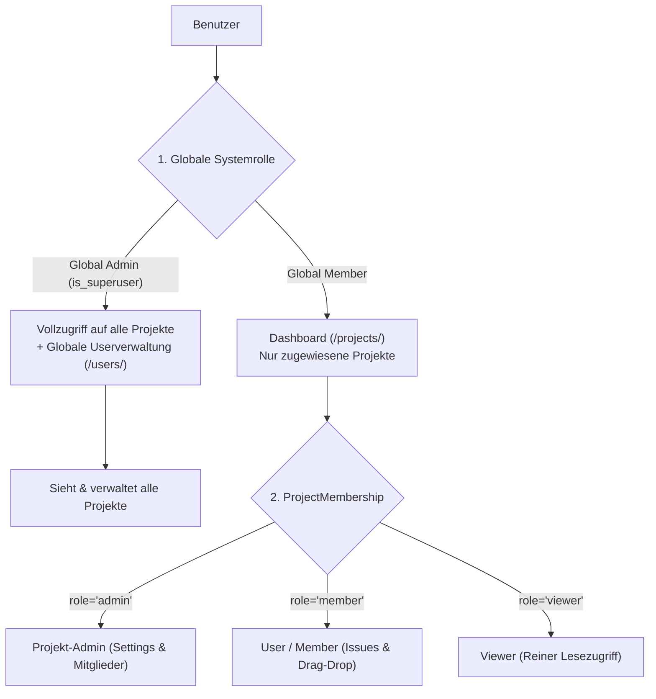

# PROJECT_CONTEXT.md

Dokumentation des aktuellen Projektstands von **Antidote (NextGen Issue-Tracker)** für menschliche und KI-Agenten zur nahtlosen Weiterentwicklung.

---

## 1. Projektübersicht

- **Zweck:** Schlanke, hochperformante Jira-Alternative zur Verwaltung von Projekten, Aufgaben (Tasks/Bugs/Stories), Kanban-Workflows, Markdown-Diskussionen und Dateianhängen mit Multi-Tenancy-Sicherheit.
- **Tech-Stack:**
  - **Backend:** Python 3.12+ (kompatibel mit 3.14), Django 6.x, Django ORM.
  - **Datenbank:** SQLite für die lokale Entwicklung (vorbereitet für PostgreSQL via `DATABASE_URL`, keine SQLite-spezifischen Eigenheiten).

  - **Frontend-Integration:** `django-inertia` (v2.0.0+) / `@inertiajs/vue3` (v2.0.3+), Single-Page-Application (SPA) ohne REST/GraphQL-Overhead.
  - **Frontend-Framework:** Vue 3.5+ (`<script setup>`, Composition API).
  - **Styling:** Tailwind CSS 3.4+, `@tailwindcss/forms`, `@tailwindcss/typography` (`prose`).
  - **Drag-and-Drop:** `vuedraggable` (v4.1.0) / `sortablejs` (v1.15.6) für optimistische Kanban-Karten-Bewegungen mit Rollback.
  - **Markdown:** `marked` (GitHub Flavored Markdown Rendering).
  - **Bundler:** Vite 6.x mit `@vitejs/plugin-vue` und Django-Template-Tag-Integration (`tracker/templatetags/vite.py`).

### Architekturansatz & Rollenmodell



- **Service-Layer verpflichtend:** Sämtliche Geschäftslogik, Berechtigungsprüfungen, Key-Generierung und Activity-Logging liegen ausschließlich in `tracker/services/`. Views orchestrieren ausschließlich HTTP/Inertia-Requests.
- **Multi-Tenancy & Isolation:** Jede Query wird strikt nach Projektmitgliedschaft (`ProjectMembership`) oder globalem Admin-Status über `PermissionService` gefiltert. Non-Members erhalten keinen Datenzugriff (HTTP 403/404).
- **Sequenzielle Issue-Keys (`PROJ-42`):** Race-Condition-sichere Generierung via `IssueKeyService` mittels `select_for_update()` auf `Project.issue_counter` innerhalb einer atomaren Transaktion mit exponentialem Backoff-Retry.
- **Soft-Delete für Issues:** Vorgänge werden über `is_deleted` und `deleted_at` audit-sicher deaktiviert und können wiederhergestellt werden.
- **Activity-Log:** Direkte Erstellung im Service-Layer ohne Django-Signals für transparente Nachvollziehbarkeit.

---

## 2. Dateistruktur & Kernkomponenten

### Vollständiger Dateibaum

```text
antidote-ng/
├── AGENTS.md                          # Verbindliche Arbeitsregeln für Entwickler und Agenten
├── PROJECT_CONTEXT.md                 # Diese Kontext-Dokumentation
├── README.md                          # Allgemeine Projektbeschreibung
├── manage.py                          # Django Management CLI
├── package.json                       # Node.js & Frontend-Abhängigkeiten
├── postcss.config.js                  # PostCSS (Tailwind & Autoprefixer)
├── pytest.ini                         # Pytest-Konfiguration (Django-Settings)
├── tailwind.config.js                 # Tailwind CSS 3 Design-Token & Farbpaletten
├── vite.config.js                     # Vite Build- & Dev-Server-Konfiguration
├── config/
│   ├── asgi.py / wsgi.py              # Server Gateway Interfaces
│   ├── settings.py                    # Django-Konfiguration (Inertia, CSRF, DB, Middleware)
│   └── urls.py                        # Root URL-Router
├── templates/
│   └── base.html                      # Inertia Root-HTML-Shell mit Vite Asset-Loader
├── tracker/
│   ├── apps.py                        # Django App-Config
│   ├── middleware.py                  # InertiaShareMiddleware (Auth Context & CSRF-Init)
│   ├── urls.py                        # App-weites URL-Routing
│   ├── validators.py                  # Validatoren (Project-Key, File-Whitelist, Max-Size)
│   ├── management/
│   │   └── commands/
│   │       └── seed_demo_data.py      # CLI-Kommando zur Initialisierung von Demo-Daten
│   ├── migrations/
│   │   └── 0001_initial.py            # Initiale Datenbankmigration
│   ├── models/
│   │   ├── __init__.py                # Model-Re-Exports
│   │   ├── project.py                 # Project, ProjectMembership, ProjectInvitation, ProjectRole
│   │   ├── issue.py                   # Issue, IssueType, IssueStatus, IssuePriority
│   │   ├── attachment.py              # IssueAttachment (File-Uploads)
│   │   ├── comment.py                 # Comment (Markdown-Diskussionen)
│   │   └── activity.py                # ActivityLog (Audit-Timeline)
│   ├── services/
│   │   ├── __init__.py                # Service-Re-Exports
│   │   ├── keys.py                    # IssueKeyService (Atomic Key Generator)
│   │   ├── permissions.py             # PermissionService (2-Tier RBAC & Tenant Scoping)
│   │   ├── projects.py                # ProjectService (Projekt-Lifecycle & Dashboard Summaries)
│   │   ├── users.py                   # GlobalUserService (Globale Userverwaltung & Projekt-Matrix)
│   │   ├── issues.py                  # IssueService (CRUD, Kanban Move, Filter & Paginierung)
│   │   ├── attachments.py             # AttachmentService (Uploads, Whitelist, Disk-Cleanup)
│   │   ├── comments.py                # CommentService (Markdown-Kommentare, Inline-Edit)
│   │   ├── activity.py                # ActivityService (Audit-Log Timeline-Generierung)
│   │   ├── auth.py                    # AuthService (Login, Register, Logout)
│   │   └── invitations.py             # InvitationService & MembershipService (Tokens, Auto-Join)
│   ├── templatetags/
│   │   └── vite.py                    # Django Template-Tag 
│   ├── views/
│   │   ├── __init__.py                # View-Re-Exports
│   │   ├── utils.py                   # Request-Parsing (JSON/Form) & ValidationError Formatter
│   │   ├── auth.py                    # Login, Register, Logout Controller
│   │   ├── users.py                   # Globale Userverwaltung Controller (/users/)
│   │   ├── projects.py                # Projekt-CRUD Controller
│   │   ├── members.py                 # Settings, Rollenupdates, Einladungen Controller
│   │   ├── invitations.py             # Einladungs-Landingpage & Auto-Join Controller
│   │   ├── issues.py                  # Kanban-Board, Listenansicht, Issue-CRUD Controller
│   │   ├── attachments.py             # Attachment Upload & Delete Controller
│   │   └── comments.py                # Comment Create, Update, Delete Controller
│   └── tests/
│       ├── test_keys.py               # Parallelitäts- & Sequenz-Tests für Issue-Keys
│       ├── test_permissions.py        # RBAC- & Multi-Tenancy-Isolations-Tests
│       ├── test_models.py             # Model-Constraints & Validierungs-Tests
│       ├── test_services.py           # Domain-Service Unit-Tests
│       ├── test_user_management.py    # Globale Userverwaltung & 2-Tier Rollen-Tests
│       ├── test_project_views.py      # Projekt-Views Integrationstests
│       ├── test_auth_views.py         # Authentifizierungs-Integrationstests
│       ├── test_invitation_and_member_views.py # Einladungs- & Rollen-Integrationstests
│       ├── test_issue_views.py        # Kanban-, Backlog- & Issue-CRUD-Tests
│       ├── test_attachment_views.py   # Upload-Sicherheits- & Whitelist-Tests
│       └── test_comment_views.py      # Kommentar- & Moderations-Tests
└── frontend/
    ├── main.js                        # Inertia.js App Setup & Axios CSRF-Defaults
    ├── css/
    │   └── app.css                    # Tailwind Direktiven & Custom Scrollbar Styles
    ├── Components/
    │   ├── AppLayout.vue              # Globales Layout (Header, Nav-Tabs, User-Menu, Modals)
    │   ├── IssueCard.vue              # Draggable Kanban-Karte mit Key, Typ, Priorität, Assignee
    │   ├── IssueDetailSlideOver.vue   # Slide-over Drawer / Detailview mit Inline-Editing
    │   ├── CreateIssueModal.vue       # Schnellerstellungs-Modal für Issues
    │   ├── MarkdownEditor.vue         # Markdown-Editor mit Toolbar (Write/Preview Tabs)
    │   ├── MarkdownViewer.vue         # Gerendertes Markdown mit Syntax-Elementen
    │   ├── AttachmentManager.vue      # Drag-and-Drop File-Upload Dropzone & Thumbnail-Vorschau
    │   ├── CommentSection.vue         # Kommentarliste mit Inline-Edit & Markdown
    │   ├── ActivityTimeline.vue       # Vertikale visuelle Timeline aller Issue-Änderungen
    │   ├── UserAvatar.vue             # Initialen-Avatar mit deterministischer Farbcodierung
    │   ├── IssueStatusBadge.vue       # Status-Pills (To Do, In Progress, Review, Done, Canceled)
    │   ├── IssuePriorityBadge.vue     # Prioritäts-Badges (Low, Medium, High, Urgent)
    │   └── IssueTypeBadge.vue         # Typ-Badges (Task, Bug, Story)
    └── Pages/
        ├── Admin/
        │   └── Users/
        │       └── Index.vue          # Globale Userverwaltung mit Projekt-Zugriffsmatrix
        ├── Auth/
        │   ├── Login.vue              # Sign-In Maske (Username oder E-Mail)
        │   ├── Register.vue           # Registrierungsmaske (inkl. Einladungs-Auto-Join)
        │   ├── InviteAccept.vue       # Einladungs-Landingpage
        │   └── InviteExpired.vue      # Fehlerseite für ungültige/abgelaufene Tokens
        ├── Projects/
        │   ├── Index.vue              # Projekt-Dashboard (Kartenansicht aller Projekte)
        │   ├── Board.vue              # 5-Spalten Kanban-Board (VueDraggable)
        │   ├── Settings.vue           # Projekteinstellungen, Rollen, Einladungs-Links
        │   └── Show.vue               # Redirect/Show-Container
        └── Issues/
            ├── Index.vue              # Listenansicht/Backlog mit Filtern & Paginierung
            └── Show.vue               # Standalone Issue-Detailseite
```

---

### Wichtige Module & Elemente

#### 1. Modelle ([`tracker/models/`](file:///home/edgar/Videos/antidote-ng/tracker/models/))
- `Project`: `name`, `slug` (unique), `key` (uppercase, 2-10 chars), `description`, `owner` (FK User), `issue_counter` (PositiveInteger).
- `ProjectMembership`: `user` (FK), `project` (FK), `role` (`admin`, `member`, `viewer`), `unique_together = (user, project)`.
- `ProjectInvitation`: `project` (FK), `email`, `role`, `token` (URL-safe secret, unique), `invited_by` (FK), `expires_at`, `is_accepted`.
- `Issue`: `project` (FK), `number` (Integer), `key` (`PROJ-42`, unique), `title`, `description` (Markdown), `type` (`task`, `bug`, `story`), `status` (`todo`, `in_progress`, `review`, `done`, `canceled`), `priority` (`low`, `medium`, `high`, `urgent`), `reporter` (FK), `assignee` (FK, nullable), `due_date` (Date, nullable), `position` (PositiveInteger für Sortierung in Kanban-Spalte), `is_deleted` (Bool), `deleted_at` (DateTime).
- `IssueAttachment`: `issue` (FK), `file` (FileField), `filename`, `file_size`, `content_type`, `uploaded_by` (FK).
- `Comment`: `issue` (FK), `author` (FK), `content` (Markdown), `is_edited` (Bool).
- `ActivityLog`: `issue` (FK), `actor` (FK, nullable), `action` (`created`, `status_changed`, `priority_changed`, `assignee_changed`, `attachment_added`, `attachment_removed`, `comment_added`, `soft_deleted`, `restored`), `field_changed`, `old_value`, `new_value`.

#### 2. Services ([`tracker/services/`](file:///home/edgar/Videos/antidote-ng/tracker/services/))
- `PermissionService`: Zentrale RBAC-Prüfung (`is_global_admin`, `can_manage_global_users`, `can_view_project`, `can_manage_project`, `can_manage_members`, `can_invite`, `can_create_issue`, `can_edit_issue`, `can_delete_issue`, `can_add_comment`, `can_edit_comment`, `can_upload_attachment`, `filter_projects_for_user`, `filter_issues_for_user`).
- `IssueKeyService`: Generiert atomar `(number, formatted_key)` mit `select_for_update()` und Lock-Contention-Retry mit Jitter.
- `ProjectService`: `create_project`, `update_project`, `delete_project`, `get_user_projects_summary`, `get_all_projects_for_management`.
- `GlobalUserService`: `list_users_with_project_memberships`, `create_user`, `update_user`, `update_user_project_access`, `delete_user`.
- `IssueService`: `create_issue`, `update_issue` (Inline-Fields), `move_issue` (Spaltenwechsel & Positions-Shift), `soft_delete_issue`, `restore_issue`, `get_project_kanban_board_data`, `get_project_issues_list` (Live-Filterung & Paginierung), `get_issue_detail_data`.
- `AttachmentService`: `upload_attachment` (Größen- und Whitelist-Validierung), `delete_attachment` (physische Datei + DB-Row).
- `CommentService`: `create_comment`, `update_comment`, `delete_comment`, `get_issue_comments`.
- `ActivityService`: Protokolliert CRUD- und Workflow-Ereignisse, `get_issue_activity_timeline`.
- `AuthService` & `InvitationService`: Login/Register/Token-Handling.

---

### Wichtige CSS-Klassen & Farbvariablen

- **Tailwind Brand-Palette ([`tailwind.config.js`](file:///home/edgar/Videos/antidote-ng/tailwind.config.js)):**
  - `brand-50`: `#f5f7ff`
  - `brand-100`: `#ebf0fe`
  - `brand-200`: `#ced9fd`
  - `brand-500`: `#4f46e5` (Primary Indigo)
  - `brand-600`: `#4338ca`
  - `brand-700`: `#3730a3`
  - `brand-900`: `#1e1b4b`
- **Status-Farbcodierung:**
  - `todo`: Neutral/Slate (`bg-slate-100`, `text-slate-700`, `border-slate-300`)
  - `in_progress`: Blue (`bg-blue-50`, `text-blue-700`, `border-blue-400`)
  - `review`: Purple (`bg-purple-50`, `text-purple-700`, `border-purple-400`)
  - `done`: Emerald (`bg-emerald-50`, `text-emerald-700`, `border-emerald-400`)
  - `canceled`: Zinc/Muted (`bg-zinc-100`, `text-zinc-600`, `border-zinc-300`, `line-through`)
- **Prioritäts-Indikatoren:**
  - `urgent`: Red (`text-red-700`, `bg-red-50`, animierter roter Puls-Punkt)
  - `high`: Orange (`text-orange-700`, `bg-orange-50`)
  - `medium`: Amber (`text-amber-700`, `bg-amber-50`)
  - `low`: Slate (`text-slate-600`, `bg-slate-100`)
- **Custom CSS ([`frontend/css/app.css`](file:///home/edgar/Videos/antidote-ng/frontend/css/app.css)):**
  - Schlanke Scrollbars für Kanban-Spalten (`::-webkit-scrollbar`, thumb: `#cbd5e1`, hover: `#94a3b8`).

---

## 3. Konventionen & Constraints

### A. Architektur & Code-Regeln
1. **Keine Business-Logik in Views:** Views fungieren ausschließlich als Request-Dispatcher und rufen Services auf.
2. **Sprachkonvention:** Code, Variablen-, Modell- und Funktionsnamen zwingend auf **Englisch**. Kommentare, Dokumentation und Antworten auf **Deutsch**.
3. **Type Hints & Docstrings:** Alle Python-Funktionen und -Methoden besitzen Type Hints; alle Service-Klassen haben Docstrings.
4. **Keine Code-Platzhalter:** Kein `# ... rest of implementation`. Code muss vollständig und lauffähig sein.
5. **CSRF-Handling für Inertia/Axios:**
   - Django-Settings: `CSRF_COOKIE_NAME = "XSRF-TOKEN"`, `CSRF_HEADER_NAME = "HTTP_X_XSRF_TOKEN"`, `CSRF_COOKIE_HTTPONLY = False`.
   - `InertiaShareMiddleware` ruft bei jedem Request `get_token(request)` auf, um den Cookie im Response-Header zu garantieren.
   - Frontend `frontend/main.js` setzt `axios.defaults.xsrfCookieName = 'XSRF-TOKEN'` und `axios.defaults.xsrfHeaderName = 'X-XSRF-TOKEN'`.
6. **Optimistische UI-Updates:** Drag-and-Drop aktualisiert den Vue-State sofort lokal und führt bei HTTP-Fehler ein Rollback auf den vorherigen Snapshot durch.

### B. Standard-Zugangsdaten (Seed-Daten)

Erstellbar/Zurücksetzbar über `.venv/bin/python manage.py seed_demo_data`:
- **Global Admin:** `admin` / `admin@example.com` (Passwort: `admin123`)
- **Member (Developer):** `developer` / `dev@example.com` (Passwort: `password123`)
- **Viewer:** `viewer` / `viewer@example.com` (Passwort: `password123`)

---

## 4. Offene Punkte / Next Steps

Mögliche nächste Erweiterungen für nachfolgende Iterationen:

1. **E-Mail- & Notification-System:**
   - Integration eines E-Mail-Backends (SMTP / Anymail / Console) für Einladungs-Mails und Issue-Zuweisungs-Benachrichtigungen.
   - In-App-Glocken-Notification-Center für Erwähnungen (`@username`) in Kommentaren.
2. **Saved Views & Custom Filter:**
   - Speichern benutzerspezifischer Suchfilter (z. B. "Meine offenen Bugs", "Diese Woche fällig") im Dashboard.
3. **Sprint- / Milestone-Planung:**
   - Einführung eines `Milestone`- / `Sprint`-Modells zur Gruppierung von Issues und Release-Tracking.
4. **Echtzeit-Kollaboration:**
   - WebSockets (Django Channels) oder Server-Sent Events (SSE) für Live-Card-Updates auf dem Kanban-Board bei gleichzeitiger Bearbeitung durch mehrere Teammitglieder.
5. **Dark Mode Theme:**
   - Bereitstellung eines Tailwind `dark:`-Modus mit Toggle im Benutzerprofil.
